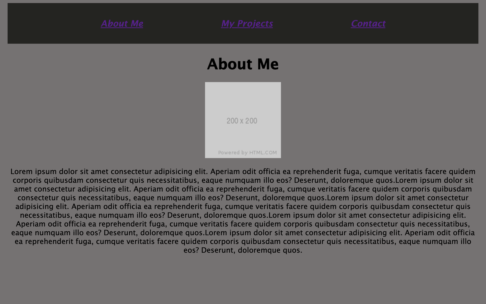

# React Portfolio

## Description
This a portfolio created used React. React is an open-source JavaScript library focused on the development of user interfaces. The React takes place of what would be basic HTML and CSS as seen in previous portfolios.

## Screenshot

## Links 

https://smith-portfolio.herokuapp.com/

https://github.com/chelssmith/reactPortfolio